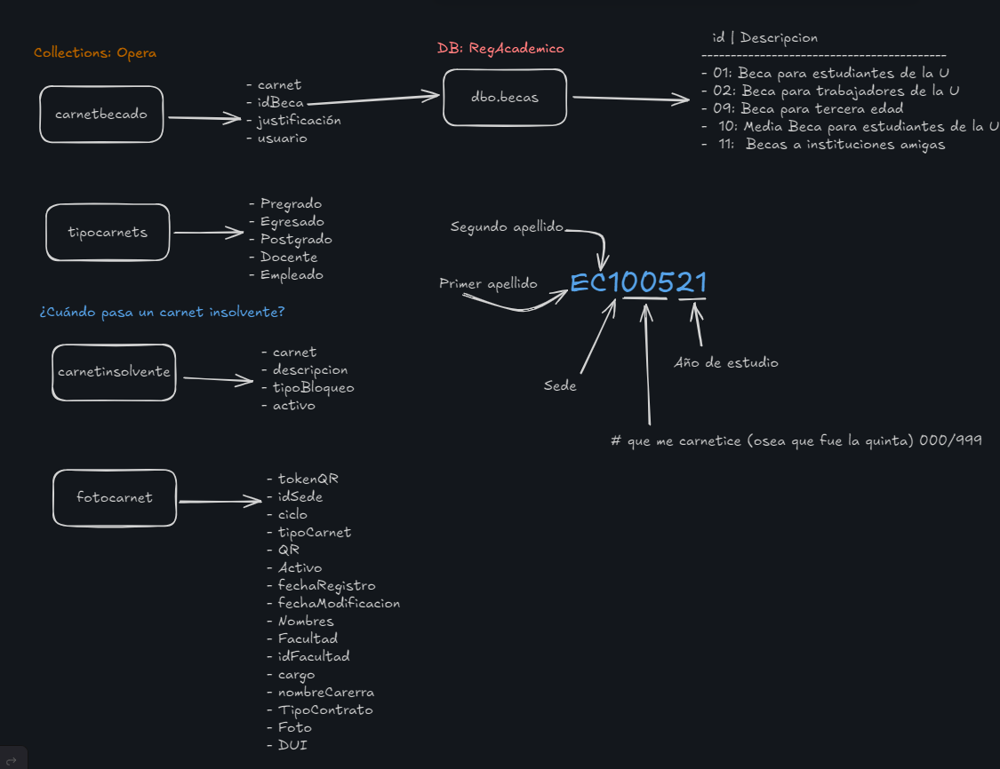
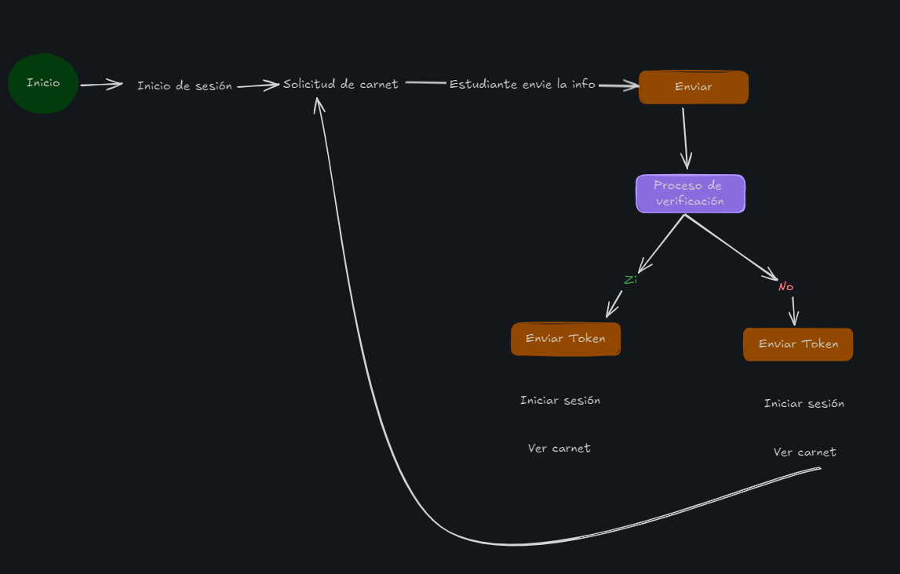
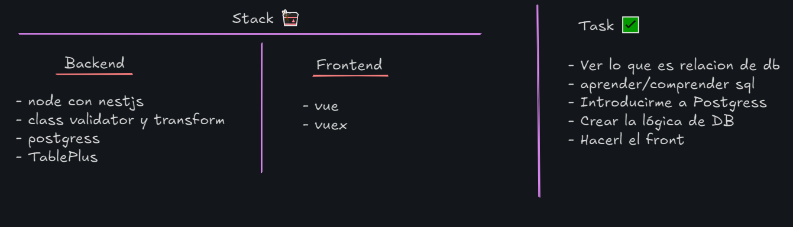
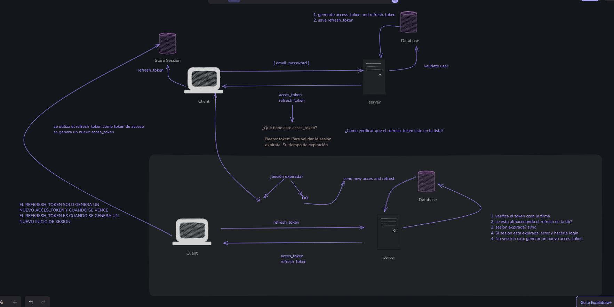

### Para correr el proyecto
```
npm run start:dev
```
### Para levantar la BD
```
docker-compose up -d
```

**✨ Notita dev ✨**
si voy a usar variables de entorno, tengo que descargar la dependencia"
```
npm install @nestjs/config
```
Y crear mi carpeta config para hacer la configuracion en el modulo principal

### Modelos y Base de datos 🐑

### Idea de flujo 🛫

### Stack y Task 👀


https://www.youtube.com/watch?v=h-68sqxycJY

---
Built-in Passport Guards#
The Guards chapter describes the primary function of Guards: to determine whether a request will be handled by the route handler or not. That remains true, and we'll use that standard capability soon. However, in the context of using the @nestjs/passport module, we will also introduce a slight new wrinkle that may at first be confusing, so let's discuss that now. Consider that your app can exist in two states, from an authentication perspective:

the user/client is not logged in (is not authenticated)
the user/client is logged in (is authenticated)

---
### Flujo de `acces_token` y `refresh_token`


---
TODO:
- HACER LOS DEMÁS ENDPOINT Y DEJAR POR ULTIMO LA AUTORIZACION
Endpoint a trabajar:
- Ver proceso de carnetizacion ✅
- Ver carnet:
    - Titulo de universidad
    - ciclo
    - Carrera
    - Nombre
    - Carnet
    - QR
    - Imagen
A partir de eso, que necesitaria para ingresar el carnet?
- Insertar Informacion de carnet:
    - imagen
    - sede
    - tipo carnet
    - nombre
    - carrera
    - facultad
    - idfacultad

Puntos que creo que hay que investigar sobre la marcha
    - ¿Cómo guardar las imagenes en nest?
    - ¿Cómo generar el token?
    - Si los carnet son templates, como llamarlos?
¿Qué podrá ser un admin?
    - Ver la fotografia
    - Enviar comentarios
    - Rechazar la foto
    - Aceptar la foto
    - Insertar fecha de vencimiento para carnet (aunque no es asi)
¿Qué pasaría si la foto es rechaza en el panel del estudiante?
    - Se le mostraria el comentario del admin
    - Se insertaria solo la fotografia
    - Se enviaría
¿Si hay necesidad de hacer un endpoint para el QR, que se mostraría?
    - carnet
    - carrera
    - facultad
    - idfacultad
    - nombre completo
    - DUI
Reto de ultimo:
- Ver como generar pdf para constancia de notas
- Ver como generar comprobante de inscripción

---
Resource:
- [JWT Refresh Token](https://dev.to/jeanvittory/jwt-refresh-tokens-2g3d)
- [JWT utilies Nest](https://github.com/nestjs/jwt)
- [Passport auth and passpor](https://fintech.theodo.com/blog-posts/implementing-authentication-in-nestjs-using-passport-and-jwt)

---
Esta es la forma para usar el TypeORM :
```
//conexion para sql server
    TypeOrmModule.forRoot({
      type: 'mssql',
      host: process.env.HOST,
      port: 1433,
      username: process.env.USER_SQL,
      password: process.env.PASSWORD_SQL,
      database: process.env.REGACADEMICO_DB,
      synchronize: false,
      migrations: ['dist/migrations/*.js'],
      migrationsTableName: 'migrations',
      options: {
        encrypt: true,
        trustServerCertificate: true,
      },
      extra: {
        pool: {
          max: 10,
          min: 0,
          idleTimeoutMillis: 30000,
        }
      }
    }),
```
Otra manera de conectarse a SQL Server sin necesidad de usar TypeORM

```
/ @Injectable()
// export class SqlServerService {

//     private sqlConfig: sql.config
//     private sqlPool: sql.ConnectionPool

//     constructor() {
//         this.sqlConfig = {
//             user: process.env.USER_SQL,
//             password: process.env.PASSWORD_SQL,
//             server: process.env.HOST,
//             database: process.env.REGACADEMICO_DB,
//             options: {
//                 encrypt: true,
//                 trustServerCertificate: true
//             },
//             sqlPool: {
//                 max: 10,
//                 min: 0,
//                 idleTimeoutMillis: 30000,

//             }
//         }
//         this.initialize()
//     }

//     private async initialize() {
//         try {
//             this.sqlPool = await sql.connect(this.sqlConfig)
//             console.log('🙌 | Database SQL Server connected')
//         } catch (err) {
//             console.log('🚩 KHEK, ERROR IN INITIALIZE ')
//             throw err
//         }
//     }

//     private async runQuery(sqlQuery: string) {
//         try {
//             const result = await this.sqlPool.request().query(sqlQuery)
//             return result.recordset
//         } catch (err) {
//             console.log('🚩 KHEK, ERROR IN QUERY ')
//             throw err
//         }
//     }

//     async onModuleDestroy() {
//         try {
//             if (this.sqlPool) {
//                 await this.sqlPool.close()
//                 console.log('🚪 | Database connection pool closed')
//             }
//         } catch (err) {
//             console.log('🚩 | Someting ocurring in onModuleDestroy...')
//             throw err
//         }
//     }
// }
```

---
¿CÓMO SE SOLUCIONO EL PROBLEMA QUE NO ME RETORNABA LA INFORMACIÓN?
1. DESPUÉS DE CREAR LO DE DOCKER COMPOSE SE CREA SEGUN EL PUERTO QUE SE LE DA
2. COMO NO SE LE HA IMPORTADA INFORMACION, NO ME RETORNABA Y APUNTABA AHI

¿POR QUÉ APUNTABA AHI?
ES UNA PREGUNTA QUE NO ME SE RESPONDER TODAVIA 😭


---

### Para hacer database first
```
npx typeorm-model-generator -h "192.168.98.20" -d RegistroAcademicoDev -p 1433 -u sa -x "5dZ8psbVg7mp6M" -e "mssql"
```

Después de generar las migraciones, se debe registrar las entidades en TypeORM

ref: [typeorm-model-generator](https://github.com/Kononnable/typeorm-model-generator) 